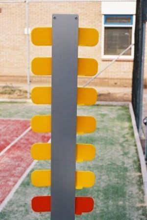

# tennisbord
Tennis score board automation

Dit project heeft als doel een geautomatiseerd tennis score bord te maken uitgaande van een bestaande fysiek scoreboard.
Door middel van kantelsensoren zullen we het scorebord digitaliseren en via LoRa worden de wijzigingen doorgestuurd naar het Things Network. Hierna wordt de data naar een web site doorgestuurd om te vertonen.

In dit project gebruiken we:
- 1 [The Things Uno bord](https://shop.thethingsnetwork.com/index.php/product/the-things-uno/).
- 14 tilt sensoren ([SW-520D](http://www.dx.com/nl/p/angular-transducer-tilt-slant-angle-sensor-module-for-arduino-150783?tc=EUR&gclid=EAIaIQobChMIl93Ug4ij1gIViD8bCh0ksg6TEAkYESABEgJ5lvD_BwE#.WbmdlNMjHfY))
- veel kabels
- 1 batterij
- waterdicht makend spul